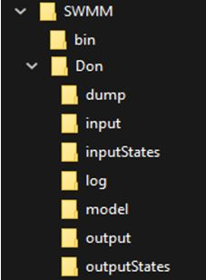
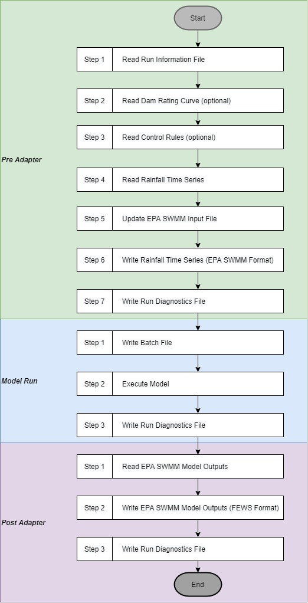
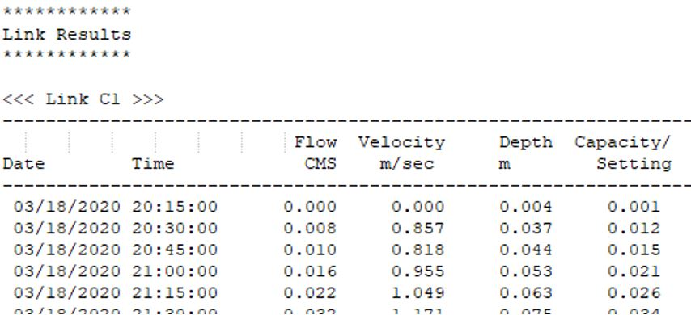
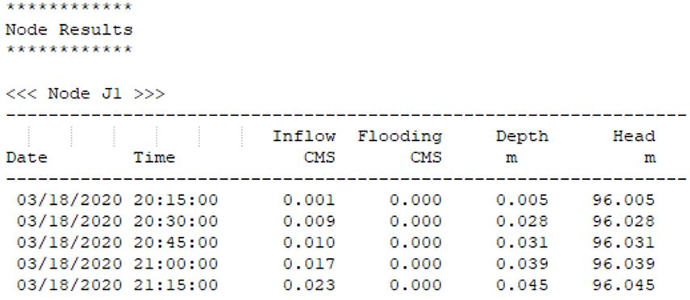

# Table of Contents  
- [Introduction](#introduction)  
- [Directory Structure and Contents](#directory-structure-and-contents)  
  

  
  
# **Directory Sturcture and Contents**  
  
The external model adapter relies on a consistent directory structure, as proposed by Deltares, and shown in Figure 1. The example shows the Don model, however, other models could be added to this directory using the same directory structure.  
  
  
  
_Figure 1 - EPA SWMM External Model Adaptor - Directory structure_  
  
Folder and file contents are specified below, and the workflow is described in the following section.  
  
**bin** : common executable files to all models  
  
- EPA SWMM executable (```SWMM5.exe```; version 5.1.012)  
- Compiled model adapter executable (```epaswmm.exe```)  
  
**Don** : all files relating to a specific EPA SWMM model (i.e. Don River Model).  
  
- Run Information (```run_info.xml```) in FEWS XML format  
- **dump** : zipped folders of the model folder when the model run fails  
- **input** : model inputs, exported by FEWS:  
  - Rainfall Timeseries (e.g. ```rain.nc```) in FEWS NetCDF Format  
  - Rating Curves (e.g. ```dam_rating_curve.xml```) in FEWS XML format (optional)  
  - Control Rules (e.g. ```control_rules.xml```) in FEWS XML format (optional)  
- **inputStates** : placeholder directory for potential handling of hotstarts  
- **log** :  
  - Model adapter logs:  
    - Pre-adapter (```pre_adapter.log```)  
    - Post-adapter (```post_adapter.log```)  
    - Model run (```run_adapter.log```)  
  - Output diagnostic file to be imported by FEWS (e.g. diag.xml)  
- **model** : EPA SWMM model files  
  - Model input file (e.g. ```DonRiver.inp```)  
  - Model rainfall data file(e.g. ```rain.dat```)  
  - Model output file(e.g. ```DonRiver.rpt```)  
  - Model run batch file (```run_model.bat```)  
  - Unit conversion look-up (```UDUNITS_lookup.csv```)  
- **output** : output from the model adapter (converted output for FEWS)  
  - EPA SWMM Model output in NetCDF format  
    - Node (e.g. depths) results (e.g. ```DonRiver_outputswmm_nodes.nc```)  
    - Link (e.g. hydrographs) results (e.g. ```DonRiver_outputswmm_nodes.nc```)  
- **outputStates** : placeholder directory for potential handling of hotstarts for future versions  
  
# **External Model Adapter Workflow**  
  
The model adapter consists of two principal components:  
  
**1.  Pre-Adapter** : converts files exported from FEWS (.nc, .xml) to EPA SWMM formatted files (.inp, .dat).  
**2. Post-Adapter**: converts EPA SWMM model output files (.rpt) into FEWS formatted files (.nc), to be input into FEWS.  
  
A FEWS simulation is composed of the following components. First, FEWS initiates the  **Pre-Adapter**. Next, FEWS initiates the model run using the updated EPA SWMM input files. Finally, FEWS initiates the **Post-Adapter** to retrieve model output files. The main steps of the EPA SWMM model adapter workflow are summarized in Figure 2 below and explained in more detail in the following sections. As a complement of information, the adapter messaging and error handling is described in section 4.4.  

  

_Figure 2 Summary of steps of the model adapter_  
  
 ## 1. **Pre-Adapter**  
  
The pre-adapter can be initiated with the following command:  

		epaswmm.exe --run_info <path to run_info.xml file> pre  
The following steps explain the behavior of this pre-adapter.  
  
**1. Read the run information file**  
  
The run information file contains data relating to the model run, such as model start time.  
  
- File path: run_info.xml  
- File contents (example):  

```
<?xml version="1.0" encoding="UTF-8"?>
<Run xmlns:xsi="http://www.w3.org/2001/XMLSchema-instance" xmlns="http://www.wldelft.nl/fews/PI" xsi:schemaLocation="http://www.wldelft.nl/fews/PI http://fews.wldelft.nl/schemas/version1.0/pi-schemas/pi_run.xsd" version="1.5">
	<timeZone>-5.0</timeZone>
	<startDateTime date="2020-03-29" time="12:00:00"/>
	<endDateTime date="2020-03-31" time="12:00:00"/>
	<time0 date="2020-03-31" time="12:00:00"/>
	<lastObservationDateTime date="2020-03-31" time="12:00:00"/>		<workDir>C:Users\pbishop\Documents\0_WORKING\30900_DelftFEWsPilot\epa-swmm-adaptor\tests\module_adapter_deploy\DonFull</workDir>	<inputNetcdfFile>C:\Users\pbishop\Documents\0_WORKING\30900_DelftFEWsPilot\epa-swmm-adaptor\tests\module_adapter_deploy\DonFull\input\rain.nc</inputNetcdfFile><inputRatingCurveFile>C:\Users\pbishop\Documents\0_WORKING\30900_DelftFEWsPilot\epa-swmm-adaptor\tests\module_adapter_deploy\DonFull\input\Dam_rating_curve.xml</inputRatingCurveFile>	<inputTimeSeriesFile>C:\Users\pbishop\Documents\0_WORKING\30900_DelftFEWsPilot\epa-swmm-adaptor\tests\module_adapter_deploy\/DonFull\input\Control_rules.xml</inputTimeSeriesFile>
	<outputDiagnosticFile>C:\Users\pbishop\Documents\0_WORKING\30900_DelftFEWsPilot\epa-swmm-adaptor\tests\module_adapter_deploy\DonFull\log\run_diagnostics.xml</outputDiagnosticFile>
			<properties>
				<string key="model-executable" value="C:\Users\pbishop\Documents\0_WORKING\30900_DelftFEWsPilot\epa-swmm-adaptor\tests\module_adapter_deploy\bin\swmm5.exe"/> 
				<string key="swmm_input_file" value="C:\Users\pbishop\Documents\0_WORKING\30900_DelftFEWsPilot\epa-swmm-adaptor\tests\module_adapter_deploy\DonFull\model\DonFull.inp"/>
			</properties>
</Run>
```		        
		  
		  
**2. Read Dam Rating Curve (optional)**  
  
FEWS can export a dam rating curve in XML format as stage-discharge flow pairs. If an <inputRatingCurveFile> is provided in the run information file, the adapter recognizes this as a dam rating curve, and proceeds to update the &quot;Curves&quot; section of the EPASWM model input file (see step 5). Only a single rating curve for each location (```<locationID>```) is allowed.  
  
- File path: Defined by ```<inputRatingCurveFile>``` in ```run_info.xml ``` 
  
- File contents (example):  
```
<?xml version="1.0" encoding="UTF-8"?>
<RatingCurves xmlns="http://www.wldelft.nl/fews/PI" xmlns:xsi="http://www.w3.org/2001/XMLSchema-instance" xsi:schemaLocation="http://www.wldelft.nl/fews/PI http://fews.wldelft.nl/schemas/version1.0/pi-schemas/pi_ratingcurves.xsd">
<ratingCurve>
<header>
	<locationId>LocationX</locationId>
	<startDate date="2018-01-01" time="00:00:00"/>
	<stageUnit>m</stageUnit>
</header>
<table>
	<interpolationMethod>linear</interpolationMethod>
	<minStage>1</minStage>
	<maxStage>6</maxStage>
	<row stage="1" discharge="0"/>
	<row stage="2" discharge="0"/>
	<row stage="3" discharge="10"/>
	<row stage="4" discharge="15"/>
	<row stage="5" discharge="20"/>
	<row stage="6" discharge="40"/>
</table>
</ratingCurve>
</RatingCurves>
 ``` 
Note that the validity period (use of the ```<startDate>``` attribute) of the rating curve is not currently supported by the model adapter; this parameter is ignored.  
  
**3. Read Control Rules (optional)**  
  
FEWS can export time-dependent control rules in XML format. The model adapter does not currently support other types of control rules (e.g. rules dependent on a node water level or a link discharge). If an ```<InputTimeSeriesFile>``` with the name ```Control_rules.xml``` is provided in the Run Information file, the adapter recognizes this as control rules, and proceeds to update the &quot;Controls&quot; section of the EPA SWMMS WMM model input file (see step 5).  
  
- File path: defined by ```<inputTimeSeriesFile>``` in ```run_info.xml```  
- File Name: ```Control_rules.xml```  
- File Contents (example):  

```
<?xml version="1.0" encoding="UTF-8"?>
<TimeSeries xmlns="http://www.wldelft.nl/fews/PI" xmlns:xsi="http://www.w3.org/2001/XMLSchema-instance" xsi:schemaLocation="http://www.wldelft.nl/fews/PI http://fews.wldelft.nl/schemas/version1.0/pi-schemas/pi_timeseries.xsd" version="1.5">

<timeZone>-5.0</timeZone>
<series>
<header>
	<type>accumulative</type>
	<locationId>OL341</locationId>
	<parameterId>OUTLET</parameterId>
	<timeStep unit="second" multiplier="3600"/>
	<startDate date="2020-04-23" time="15:00:00"/>
	<endDate date="2020-04-29" time="15:00:00"/>
	<missVal>NaN</missVal>
	<stationName>G Ross Dam</stationName>
	<units>m</units>
</header>
<event date="2020-04-23" time="15:00:00" value="0.5" flag="8"/>
<event date="2020-04-23" time="16:00:00" value="0.2" flag="8"/>
</series>
</TimeSeries> 
  ```
  
Additional information on how this information is written to control rules in the model input file is included in step 5.  
  
The ```<parameterID>``` refers to the EPA SWMM object to which the rule will apply. As such, this parameter should be one of the following EPA SWMM object types: pump, orifice, weir or outlet.  
  
EPA SWMM control rules may also use a “priority” level at the end of the rule. While there is potential to use the “flag” attribute (e.g. flag = “8”) to set priority levels of control rules in the model, this feature is not currently implemented and the “flag” attribute is ignored by the model adapter.  
  
 **4. Read Rainfall Time Series**  
  
Delft-FEWS exports a rainfall time series file in NetCDF format. The ```station_id```  (e.g. DON_1) in this file correspond to the rain gage name in the &quot;Raingages&quot; section of the EPA SWMM input file. The ```station_name``` field is ignored by the model adapter as this is for display purposes within the FEWS interface.  
  
- File path: defined by ```<inputNetcdfFile>``` in the ```run_info.xml``` file  
- File contents (example, showing a sample of rowsfirst and last rows):  

  
  
_Figure 3 - Example rainfall time series file contents_  
  
**5. Update EPA SWMM Input File**  
  
The EPA SWMM input file contains some sections with constant values (e.g. subcatchment parameters). Other sections contain data that needs to be updated for the model run. This step explains how these sections are updated.  
  
- File path: defined by the swmm_input_file in the ```<properties>``` section of the ```run_info.xml``` file. (e.g. ```Don/model/DonRiver_template.inp```)  
  
The model adapter reads in EPA SWMM Input file, and updates:  
  
- the &quot;**Options**&quot; section using variables read from the run information file  
- the &quot;**Curves**&quot; section with the rating curves provided by FEWS  
- the &quot;**Controls**&quot; section with the control rules provided by FEWS  
  
The rainfall time series is written to an external file in step 6.  
  
  
The &quot;**Options**&quot; section is updated as follows:  

| Parameter in EPA SWMM model input file | FEWS parameter in the run information file | Result in EPA SWMM model input file |  
| --- | :-: | --- |  
| ```START_DATE``` |```<startDateTime date="2020-04-23"time="15:00:00"/> ```| ```START DATE 04/23/2020``` |  
```START_TIME``` | ""  |```START_TIME 15:00:00``` |  
| ```REPORT_START_DATE``` |""|```REPORT_START_DATE 04/23/2020``` |  
| ```REPORT_START_TIME``` |""| ```REPORT_START_TIME 15:00:00``` |  
| ```END_DATE``` | ```<endDateTime date="2020-04-29" time="15:00:00"/>``` | ```END_DATE = 04/29/2020``` |  
| ```END_TIME``` | ""|```END_TIME 15:00:00``` |  


The &quot; **Controls**&quot; section is updated as follows:  
  
 - If no control rules were provided by FEWS, no change to the &quot;Controls&quot; section of the model input file is made. 
 - If control rules were provided by FEWS but no &quot;Controls&quot; section exists in the model input file, an error is provided prompting the user to setup control rules in the model, and the adapter stops execution. 
 - If control rules were provided by FEWS and a &quot;Controls&quot; section exists in the EPA SWMM input file, the FEWS control rules will be written to the bottom of the control rule section. Existing rules are not modified. 
 - A control rule in EPA SWMM consists of a condition clause and an action clause, for example: 
	- Condition clause:
	 ```IF SIMULATION DATE = 04/23/2020``` <br>```AND SIMULATION CLOCKTIME = 15:00:00 ```|
	- Action clause :
	```THEN OUTLET OL341 SETTING = 0.5```  
  
 - The condition clause of the control rule is built from the ```<event date>``` and ```<event time>``` variables of the control rules file (```Control_rules.xml```), with the following format:  
```IF SIMULATION DATE = <event date>``` 
```AND SIMULATION CLOCKTIME = <event time>```  
  
 - Only time-based condition clauses are supported. Other condition clauses (e.g. ```IF NODE D123 > 1```) are not supported.
 
 - The action clause of the control rule is built from the ```<locationID>```, ```<parameterID>``` and ```<event value>```, with the following format:  
```THEN <parameterId> <locationId> SETTING = <event value> ``` 
- Other types of action clauses (e.g. ```THEN PUMP STATUS = ON```) are not currently supported.  
  
- One rule is added for each line in the control rules file (```Control_rules.xml```). If rules for multiple locations exist (i.e. multiple ```<series>``` exist), the pre-fix of the control rule&#39;s number is incremented, e.g. ```AdapterRule1.1, AdapterRule1.2, ..., AdapterRule2.1, AdapterRule2.2, ...```) in the EPA SWMM input file.  

 - For example, the control rule file provided in step 3 would be appended to the bottom of the &quot;Controls&quot; section as follows:  
```
Rule AdapterRule1.1
IF SIMULATION DATE = 04/23/2020  
AND SIMULATION CLOCKTIME = 15:00:00  
THEN OUTLET OL341 SETTING = 0.5  

Rule AdapterRule1.2  
IF SIMULATION DATE = 04/23/2020  
AND SIMULATION CLOCKTIME = 16:00:00  
THEN OUTLET OL341 SETTING = 0.2  
  ```

The &quot; **Curves**&quot; section is updated as follows:  
  
 - A curve in the EPA SWMM model input file will be updated if its curve type is &quot;Rating&quot; and its curve name has a matching ```<locationID>``` in the XML file provided by FEWS. Other curve types (e.g. Storage) are currently not supported.
 - Only one curve per location (```<locationID>```) is supported. 
 - Only curves existing in the EPA SWMM model input file will be updated (adding a new curve is not supported). This ensures that the user intentionally adds the curve to the model and understands its behavior before automating the procedure of updating the curve. 
 - Curve temporal validity (e.g. the ```<startDate>```) is not considered; therefore curves are always active. 
 - If no rating curves are provided by FEWS, no change to the curves section of the model input file is made.  

For example:  
- Before update of **Curves** section:   
```
[CURVES] 
;;Name           Type       X-Value    Y-Value     
;;-------------- ---------- ---------- ----------  
;  
;  
;Rating Curve  
LocationX         Rating       2         0  
LocationX                      4         5  
LocationX                     10        10  
```

- Sample of Rating Curve XML file  
```
<ratingCurve>  
<header>  
	<locationId>LocationX</locationId>  
	<startDate date="2018-01-01" time="00:00:00"/>  
	<stageUnit>m</stageUnit>  
</header>  
<table>  
	<interpolationMethod>linear</interpolationMethod>  
	<minStage>1</minStage>  
	<maxStage>6</maxStage>  
	<row stage="1" discharge="0"/>  
	<row stage="2" discharge="0"/>  
	<row stage="3" discharge="10"/>  
	<row stage="4" discharge="15"/>  
	<row stage="5" discharge="20"/>  
	<row stage="6" discharge="40"/>  
</table>  
</ratingCurve>  
```

- After update of **Curves** section:   
```
;;Name           Type       X-Value    Y-Value     
;;-------------- ---------- ---------- ----------  
;  
;  
;Rating Curve  
LocationX         Rating       1             0  
LocationX                      2             0  
LocationX                      3            10  
LocationX                      4            15  
LocationX                      5            20  
LocationX                      6            40  
  ```
  
**6. Write Rainfall Time Series (EPA SWMM Format)**  
  
The rainfall data that was imported in step 4 is written to the rainfall file (rain.dat), with the following format:  
  
``` ;Rainfall (mm) <RAINGAGE ID> <YYYY> <M> <D> <H> <M> <QUANTITY>   ```
  
A sample of the time series is shown here:  
```
;Rainfall (mm)  
DON_1 2013 7 8 6 20 0.019  
DON_1 2013 7 8 6 25 0  
DON_1 2013 7 8 6 30 0.019  
 ...  
DON_11 2013 7 8 6 25 0  
DON_11 2013 7 9 16 30 0  
DON_11 2013 7 9 16 35 0  
DON_11 2013 7 9 16 40 0  
```
  
As described in Section 6 (Model Set-up Considerations), the rainfall format (intensity vs. depth) must be configured in the model input file to align with the format exported by FEWS.  
  
**7. Write model adapter messages to the run diagnostics file**  
  
Model adapter warnings and errors messages during the Pre-Adapter steps are written to the run diagnostics file. More details are provided in section 4.4 (Messaging and Error Handling). FEWS will read this file upon completion of the Pre-Adapter execution and will report those to the FEWS interface.  
  
## 2. **Model Run**  
  
Typically, model execution will be initiated by FEWS. However, to facilitate testing of the model adapter, the model may be run with the following command:  
  
	epaswmm.exe --run_info <path to run_info.xml file> run  
  
1. Writes a batch file for manual model runs:  
 - File Path: ```model/run_model.bat```  
 - File contents (example):  
  
```C:\[...]\bin\swmm5.exe C:\[...]\model\DonRiver.inp C:\[...]\model\DonRiver.rpt ```
  
2. Executes the model and write to the diagnostics file . Note that warnings and errors in the EPA SWMM model output file will be read by the post-adapter.  
  
 ## **3. Post-Adapter**  
  
The post-adapter can be initiated with the following command:  
  
	epaswmm.exe --run_info <path to run_info.xml file> post_  
  
The following steps explain the behavior of the post-adapter.  
  
**1. Read EPA SWMM Model Outputs**  
  
The EPASWM model run generates an output file (e.g. ```DonRiver.rpt```), which is converted to FEWS format by the Post Adapter. The following sections are read from the output file: ```Link Results``` and ```Node Results```, as shown in the examples below. Model errors and warnings will also be read, if present.  

 

  
**2. Write EPA SWMM model outputs in FEWS format**  
  
The following model results are written to the to NetCDF4 File Format using the CF 1.6 convention as requested by Deltares, for all links and nodes locations with the following variables, respectively:  
  
- Links: Date, Time, Flow CMS, Velocity m/sec, Depth m, Capacity/Setting  
- Nodes: Date, Time, Inflow CMS, Flooding CMS, Depth m, Head m  
  
To respect the CF 1.6 convention, the units in the EPA SWMM model output file (e.g. CMS; cubic metres per second) must be translated to a corresponding name for the NetCDF4 file (e.g. cubic_meter_per_second). For flexibility, this lookup can be customized in the units lookup file (```model/UDUNITS_lookup.csv```) if new unit conversions are required. All unit lookups required for the current model configuration have been provided.  
  
The association between location in Delft-FEWS (e.g. stream gauge) and location in the EPA SWMM model (e.g. Link ID) was configured in the Delft-FEWS interface. No geographical information is currently passed to FEWS in the metadata section, assuming this information will be handled by FEWS, through the Link ID.  
  
**3. Write model adapter and EPA SWMM messages to the run diagnostics file**  
  
Model adapter messages and EPA SWMM model output errors and warnings are written to the run diagnostics log, as described in section 4.4 (Messaging and Error Handling).  
  
## **4. Messaging and Error Handling**  
  
  **1. Model Adapter Messaging**  
  
Pre- and post-adapter errors, warnings, and informational messages are written to log/pre_adapter.log, log/run_adapter.log and log/post_adapter.log, respectively, with the following format:  
  
```<LEVEL>: External Adapter - <Message> (<TIME>)```  
  
For example:  
  
```INFO: External Adapter - No rating curve file provided in the run_info.xml. (2020-05-13 09:01:51,501)  ```
  
Two messaging levels are used: INFO and ERROR. If an error occurs, model execution stops after the error message is written to the log.  
  
These messages are transferred to FEWS using the run diagnostics file as described in the following section.  
  
 **2. Run Diagnostics File**  
When the model adapter either completes successfully or fails, a run diagnostics file is written for import by FEWS. This file includes all messages in the model adapter logs and all errors and warnings in the EPA SWMM output file.  
  
- File path: defined by ```<outputDiagnosticFile>``` in ```run_info.xml ``` 
- File contents (example):  
```
<?xml version="1.0" encoding="UTF-8"?>
<Diag xmlns="http://www.wldelft.nl/fews/PI"
xmlns:xsi="http://www.w3.org/2001/XMLSchema-instance"
xsi:schemaLocation="http://www.wldelft.nl/fews/PI http://fews.wldelft.nl/schemas/version1.0/pi-schemas/pi_diag.xsd" version="1.2">
<line level="3" description="INFO: External Adapter - ##### Running Pre-Adapter EPA-SWMM Delft-FEWS for C:\Users\pbishop\Documents\0_WORKING\30900_DelftFEWsPilot\epa-swmm-adaptor\tests\module_adapter_deploy\Don\run_info.xml ... (2020-05-14 10:50:28,009)"/>
<line level="3" description="INFO: External Adapter - No rating curve file provided in the run_info.xml. (2020-05-14 10:50:28,012)"/>
<line level="3" description="INFO: External Adapter - Converted the NetCDF rainfall file to EPA SWMM .DAT format (2020-05-14 10:50:28,164)"/>
<line level="3" description="INFO: External Adapter - Reading warnings and errors from: pre_adapter.log (2020-05-14 10:50:28,167)"/>
<line level="3" description="INFO: External Adapter - ##### Completed Pre-Adapter EPA-SWMM Delft-FEWS (2020-05-14 10:50:28,168)"/>
</Diag>
```
The message text from the model output file and the model adapter logs are transferred to the &quot;description&quot; field in the run diagnostics file, while the message level (e.g. &quot;WARNING&quot;) is mapped to the &quot;level&quot; field, using FEWS&#39;s 0-4 numeric code, as described in Table 1.  
  
_Table 1 – Mapping of messages from EPA SWMM model output and model adapter logs to FEWS levels_  
  
| FEWS Message Level (run diagnostics file) | Corresponding Message Level: <br><br>Model Output file (e.g. DonRiver.rpt) | Corresponding Message Level: <br><br>Model Adapter Log  (pre_adapter.log and post_adapter.log) |  
 | :-- | :-: |  :-: |
| 4 | - | DEBUG |  
| 3 | - | INFO |  
| 2 | WARNING | WARNING |  
| 1 | ERROR | ERROR |  
| 0 | - | - |  
  
For example, the following two messages would be converted as follows:  
  
_Table 2 – Examples of model adapter log and EPA SWMM model output messages translated for FEWS_  
  
| **Message** | **Message Location** | **Run Diagnostics Message** |  
| --- | --- | --- |  
| ```INFO: External Adapter - No rating curve file provided in the run_info.xml.``` | Model Adapter Log (pre_adapter.log) | ```<line level="3" description="INFO: External Adapter - No rating curve file provided in the run_info.xml."/>```  
 | ```WARNING 03: negative offset ignored for Link C1``` | Model Output file (e.g. DonRiver.rpt) | ```<line level="2" description="WARNING 03: negative offset ignored for Link C1"/>```  
 
  
  
1. **Model Set-up Considerations**  
  
The model adapter was developed to be generic to permit use with any EPA SWMM model. Nonetheless, there are some considerations to be made when setting up a model for use with the adapter. These are outlined in this section.  
  
- External rainfall time series must be used; the adapter does not support models that have the hyedrographs stored within the model input file itself.  
  
- The name of the external rainfall time series must be: ```rain.dat```  
- In EPA SWMM, rainfall time series are associated with rain gauge elements. These are defined in the &quot;Raingage&quot; section in the EPA SWMM model input file. Modification of the &quot;Raingage&quot; section is not currently supported by the model adapter.  
- In the current FEWS setup, a rainfall time series is exported for each major subcatchment. For example, for the Don River, there are 11 (DON_1, DON_2, ..., DON_11).  
- The rain gauges in the EPA SWMM model input file should be named after the major subcatchment that they represent, e.g. DON_11.  
  
```
[RAINGAGES]  
;; Rain Time Snow Data  
;;Name Type Intrvl Catch Source  
;;-------------- --------- ------ ------ ----------  
DON_1 INTENSITY 1:00 1 FILE "rain.dat" DON_1 MM  
DON_2 INTENSITY 1:00 1 FILE "rain.dat" DON_2 MM  
DON_3 INTENSITY 1:00 1 FILE "rain.dat" DON_3 MM  
DON_4 INTENSITY 1:00 1 FILE "rain.dat" DON_4 MM  
DON_5 INTENSITY 1:00 1 FILE "rain.dat" DON_5 MM  
DON_6 INTENSITY 1:00 1 FILE "rain.dat" DON_6 MM  
DON_7 INTENSITY 1:00 1 FILE "rain.dat" DON_7 MM  
DON_8 INTENSITY 1:00 1 FILE "rain.dat" DON_8 MM   
DON_9 INTENSITY 1:00 1 FILE "rain.dat" DON_9 MM  
DON_10 INTENSITY 1:00 1 FILE "rain.dat" DON_10 MM  
DON_11 INTENSITY 1:00 1 FILE "rain.dat" DON_11 MM  
```

- In the above example, the rain gauge DON_6 will be assigned all rainfall amounts in the rainfall time series file (rain.dat) that have the identifier &quot;DON_6&quot; at the beginning of the line:  
 
```
;Rainfall(mm)  
DON_6 2020 3 29 17 0 0.0  
DON_6 2020 3 29 18 0 0.0  
DON_6 2020 3 29 19 0 0.0  
```
  
- Each subcatchment must be associated with its corresponding rain gauge, to represent its major subcatchment. For example, subcatchment S001 is in major subcatchment DON_6, and so is defined as follows in the &quot;Subcatchments&quot; section  
 
```
[SUBCATCHMENTS]  
;; Total Pcnt. Pcnt. Curb Snow  
;;Name Raingage Outlet Area Imperv Width Slope Length Pack  
;;-------------- ---------------- ---------------- -------- -------- -------- -------- -------- -------- 
S001 DON_6 J001 40.29 11.42 3230.643 5.6 0  
```
- The rain type (e.g. intensity) and interval (e.g. 1:00) must correspond to the type and interval of rainfall exported from FEWS.  
- If FEWS is to be used to update the &quot;Controls&quot; section, an existing control rule must be defined, for example;  
  
```[CONTROLS]  
Rule GatesClosed  
IF SIMULATION TIME = 00:00:00  
THEN OUTLET OL341 SETTING = 0
```  


- If FEWS is to be used to update the &quot;Curves&quot; section, an existing curve must exist in the EPA SWMM input file, with type &quot;Rating&quot;. Updating &quot;Storage&quot; curves is not currently supported.  
- Nodes and links must set to &quot;ALL&quot; in the &quot;Report:&quot; section:  
 
 ```[REPORT] 
;;Reporting Options  
INPUT YES  
CONTROLS YES  
AVERAGES YES  
SUBCATCHMENTS ALL  
NODES ALL  
LINKS ALL  
```

- Other than the sections described in this document, no other parameters in the model input file are modified by the model adapter. Ensure all other parameters are configured as required in the model input filesetup as required, such as the hydrologic parameters and storage node water levels.  
- As described in Section 4.1 step 2, unit look-ups between EPA SWMM unit names and the NetCDF4-compliant unit names (Unidata, 2020) must be defined in the model/UDUNITS_lookup.csv file. For the current model configuration, all required units have been provided.  
  

**REFERENCES**  
  
Deltares. n.d. _Python model adapters within FEWS__._ Accessed March 26, 2020.https://publicwiki.deltares.nl/display/FEWSDOC/  
 Python+model+adapters+within+FEWS  
  
Unidata. 2020. Uni Data Data Services and Tools for Geoscience: UDUNITS. Accessed May 15, 2020. [https://www.unidata.ucar.edu/software/udunits/](https://www.unidata.ucar.edu/software/udunits/)  
  
Matrix Solutions Inc. (Matrix). 2020. _Developer Setup of EPA SWMM FEWS Model._ Prepared for Deltares USA_._ May, 2020.
<!--stackedit_data:
eyJoaXN0b3J5IjpbMTYyNjQ3OTIsMTA5MjczNDc2OSwtMTI5MT
c2NTUxNCwtMTgzMjE0NzczNiwtNjAzODQxMjg3LC03MjE0MzE2
MjYsLTExODQ1Nzg5ODIsNjc5OTk1MDQyLC0xNDU0Mzg1NjUwLD
E2NzExNTg3OTQsLTE0NzE3MTQwMTAsMTExMDY0MTEzNCwyMDE2
NzE4NDEwXX0=
-->